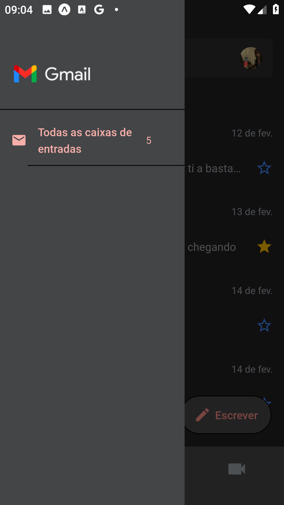
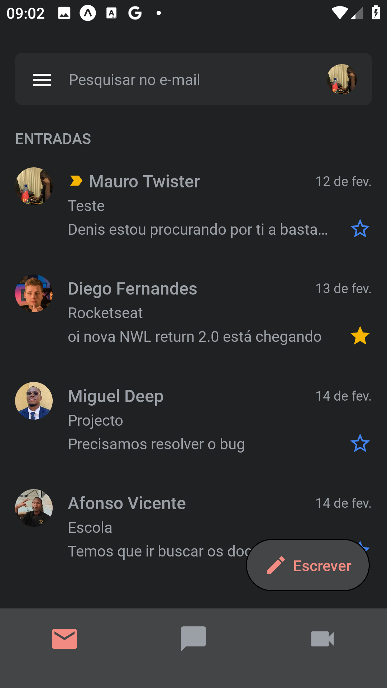

# Gmail Clone 

### Este repositório contém o projecto `Gmail Clone`. Um clone da tela de Inbox do Gmail do Google. Prática e aprendizado Para mais informações sobre o projecto, clique <a href="https://github.com/MauroTwister475/gmail-clone">aqui</a>


## Imagens após a conclusão do projecto

   <div style="display:flex; flex-wrap: wrap; gap: 10px; margin-top: 50px;">
     
      
   </div>

## Técnologias Utilizadas 📌🚀 
  - [React Native](https://reactnative.dev/)
  - [Expo](https://docs.expo.dev/)
  - [Nativewind](https://nativewind.dev/)

## Requisitos para rodar o projecto:

### Setup de ambiente: 
- Node versão - <a href="https://nodejs.org/dist/v20.11.1/node-v20.11.1-x64.msi">LTS</a> >= 20
- npm (Gerenciador de pacotes que foi utilizado no projecto)

## Como rodar o projeto?👩‍💻🚩

1 - Clone o repositório

```
git clone https://github.com/MauroTwister475/gmail-clone.git
```

2 - Rode o seguinte comando para instalar todas as dependências necessárias: 
```
npm install ou npx expo install
```

3 -  E por fim, rode o seguinte comando:
```
npm start ou npx expo start
```

## Como me localizar no projecto?

- `@/src/app`: Pasta onde estão as páginas da aplicação (rotas)
- `@/src/assets`: Pasta onde contém os arquivos de mídias utilizadas na aplicação (imagens, ícones, etc)
- `@/src/components`: Pasta onde contém os componenetes reutilizáveis, ou seja que serão usados várias vezes na aplicação
- `@/src/styles`:  Pasta que contém as configurações de estilização da aplicação (nativewind)
- `@/src/types`: Pasta que contém as interfaces ou types utilizadas na aplicação
- `@/src/utils`:  Pasta que contém as funções utilitárias da aplicação

## Ver mais sobre mim 🔗🌎

#### Minhas Redes

- Github: https://github.com/MauroTwister475/profile
- Linkedin: https://www.linkedin.com/in/mauro-raimundo-dinis-00475526a/
